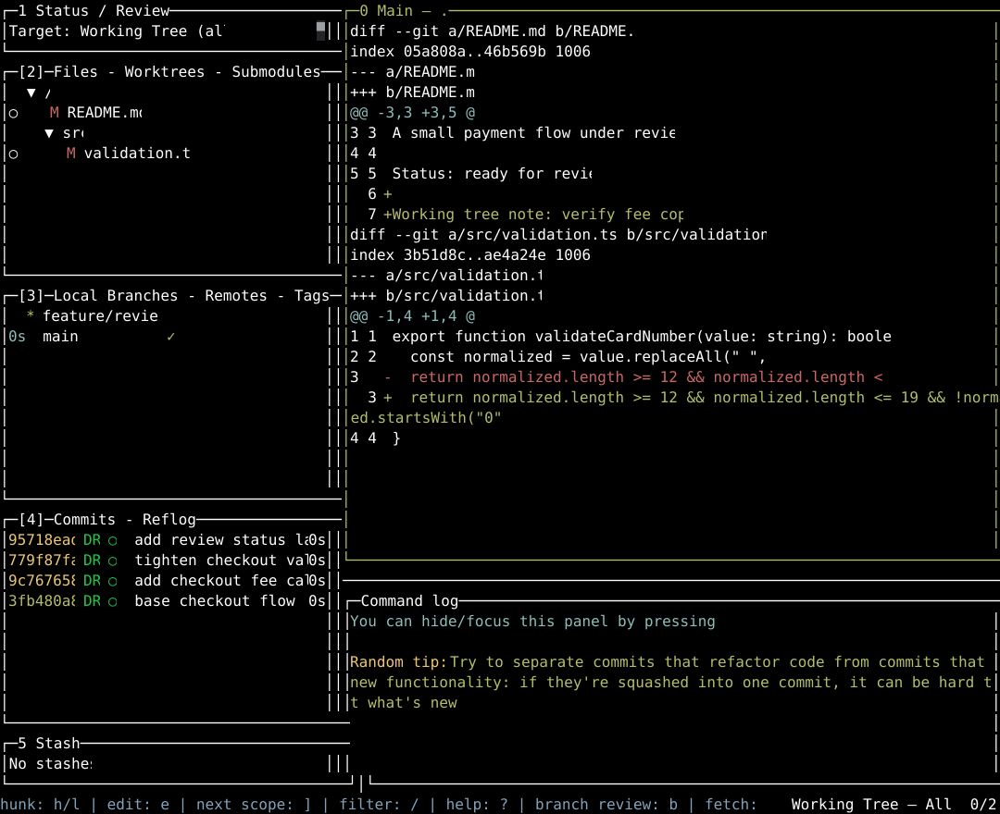

# githunk

A review-first Git TUI that mixes [lazygit](https://github.com/jesseduffield/lazygit)’s everyday Git workflow with [hunk](https://github.com/modem-dev/hunk)’s focused diff review.


## Install

No Node.js required — githunk ships as a standalone binary:

```sh
curl -fsSL https://raw.githubusercontent.com/XuHaoJun/githunk/main/install.sh | sh
```

This installs the newest release into `~/.local/bin` (or `$XDG_BIN_HOME`, or `$GITHUNK_INSTALL_DIR`), verifying its checksum first. Pin a version with `sh -s -- 0.2.0`, or pass `--no-modify-path` to skip shell-startup PATH wiring. macOS and Linux only.

Alternative via npm (needs Node.js 26.1.0 or newer just to install):

```sh
npm install --global @xuhaojun/githunk
```

## Requirements

- Git
- A terminal with interactive TUI support

`gh` is optional. When it is installed and authenticated, githunk can show GitHub pull-request status; local Git review works without it.

The launcher prefers the prebuilt binary. On platforms without one it falls back to the Node.js bundle, which needs Node.js 26.1.0 or newer; the launcher enables Node's experimental FFI support automatically for OpenTUI.

## Update

```sh
githunk update            # newest release
githunk update 0.3.0      # a specific version
githunk update --check    # report without installing
```

Standalone installs replace their own binary after checksum verification. npm installs update through npm instead: `npm update --global @xuhaojun/githunk`.

Installer knobs: `GITHUNK_VERSION` pins the version, `GITHUNK_INSTALL_DIR` overrides the install directory, `GITHUNK_NO_MODIFY_PATH=1` skips shell-startup PATH wiring.

## Usage

Run githunk from any directory inside a Git repository:

```sh
cd path/to/repository
githunk
```

Or point it at a repository from anywhere:

```sh
githunk --path path/to/repository
githunk path/to/repository
```

`githunk --help` prints all options; `githunk --version` prints the installed version.

## Development

This repository uses Bun for development and for producing the Node.js bundle published to npm:

```sh
bun install
bun run start
bun run check
bun run build
```
