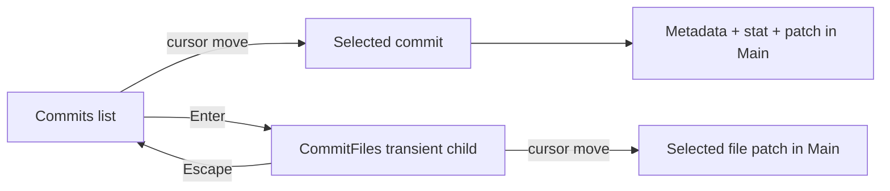

# Lazygit Core UI and Navigation Parity Design

**Status:** Approved design
**Date:** 2026-08-25
**Reference:** vendored `learn-projects/lazygit/`
**Scope:** First sub-project in the githunk v0.1 lazygit parity program

## 1. Goal

Make githunk's core panels, list navigation, tabs, commit inspection, and side-panel sizing behave like the vendored lazygit version. Preserve only three deliberate product differences:

1. the Main pane supports application-aware text selection and copy;
2. the lower-right area remains reserved for review/command-log UI;
3. the vertical and horizontal splitters remain mouse-resizable.

Every other observed difference is either fixed in this sub-project or recorded as unfinished parity work. It must not be described as an intentional product divergence.

## 2. Program Boundary

Complete lazygit feature parity is too large for one safe change. The v0.1 parity program is divided into independently testable sub-projects:

1. Core UI and navigation — this design.
2. Files, staging, and patch-building parity.
3. Branches, remotes, tags, worktrees, and submodules operations.
4. Commits, reflog, rebase, cherry-pick, and bisect operations.
5. Stash, sync, undo, custom commands, and external tools.
6. Configuration, keybinding, theme compatibility, and a full acceptance audit.

This design establishes the panel and transient-context model required by later sub-projects. It does not add unfinished views for later features.

## 3. Reference Findings

The vendored lazygit implementation establishes these observable behaviors:

- Default side-panel groups are Status; Files/Worktrees/Submodules; Branches/Remotes/Tags; Commits/Reflog; and Stash (`learn-projects/lazygit/pkg/config/user_config.go`).
- `[` and `]` select the previous and next tab in the focused multi-tab panel.
- A selected list row is highlighted; the list does not print an arrow cursor into the row.
- Commit rows contain a graph, abbreviated hash, subject, author information, and time where width permits (`pkg/gui/presentation/commits.go`).
- Enter on a commit opens a transient CommitFiles context in the same side-panel window. Escape returns to the parent commit list (`pkg/gui/controllers/switch_to_diff_files_controller.go`).
- Moving through CommitFiles updates Main with the selected file patch (`pkg/gui/controllers/commits_files_controller.go`).
- An unfocused Stash view has a fixed height of three rows in the normal layout (`pkg/gui/controllers/helpers/window_arrangement_helper.go`).
- A commit preview uses stat plus patch (`--stat -p`). Lazygit progressively reads process output; it does not switch to a file-list view when a patch crosses a size threshold (`pkg/gui/controllers/helpers/diff_helper.go`, `pkg/gui/layout.go`). The file list is the explicit Enter drill-down.

## 4. Architecture

### 4.1 Windows, tabs, and transient contexts

A numbered side-panel **window** owns geometry and focus. A **view** owns content, selection, and scrolling. Multiple tab views may share one window. A transient child view may temporarily replace its parent view in the same window.

The first-slice window configuration is:

| Window | Number | Views |
| --- | ---: | --- |
| Status | 1 | Status |
| Files | 2 | Files |
| Branches | 3 | Local Branches, Remotes, Tags; transient RemoteBranches child |
| Commits | 4 | Commits; transient CommitFiles child |
| Stash | 5 | Stash |

Worktrees and Submodules will later coexist with Files as tabs in window 2, and Reflog will later coexist with Commits as a tab in window 4, matching lazygit's default groups. They are not rendered as placeholders before their real data and behavior exist.

Each multi-tab window stores:

- active tab ID;
- stable selected item ID per tab;
- scroll position per tab;
- an optional transient child and its parent view;
- the selected stable ID used to validate a Main preview.

Focus belongs to the window, not the active tab. Pressing a numbered focus key returns to the previously active tab in that window.

While a transient child is active, `[` or `]` first returns to its parent and then selects the adjacent parent-level tab. Returning to that parent tab later does not reopen the child; entering the child is always an explicit `Enter` action.

### 4.2 State ownership

- `RootView` dispatches input and applies geometry; it does not encode panel-specific tab or drill-down rules.
- A panel state/reducer owns active tab, parent/child transitions, and stable selection restoration.
- Pane renderers consume typed rows and current selection. They do not prefix row strings with cursor arrows.
- `AppController` owns repository loading and mutation. It supplies stable repository entities and generation-safe preview results.
- Existing diff selection, clipboard, review storage, and splitter modules retain their current boundaries.

This separation prevents future Reflog, Worktrees, and Submodules tabs from adding mutually exclusive conditionals to `RootView`.

## 5. Commit Navigation and Preview Flow

### 5.1 Commit selection

Moving the commit cursor updates Main but does not change the global review target, aggregate branch target, or review-progress key. The selected commit OID is UI inspection state.

Main displays, in order:

1. commit metadata and message;
2. file stat;
3. full patch.

There is no patch-size threshold that substitutes a file list for this view.

### 5.2 Enter drill-down

Enter on a selected commit:

1. loads the commit details and changed-file list;
2. initializes CommitFiles selection to the first valid item;
3. records Commits as the parent context;
4. replaces the Commits view in window 4 with CommitFiles;
5. keeps focus in window 4;
6. renders the selected file patch in Main.

Moving through CommitFiles loads only the selected path's patch. Rename identity includes current path and previous path.

Escape restores the Commits parent, its prior OID selection, and the selected commit's metadata/stat/patch preview.

### 5.3 Async ordering

Main owns one global monotonically increasing preview generation across every preview source: Files, branches, remotes, tags, commits, commit files, and stash. Starting a request or synchronously changing Main context increments the generation. A result may update Main only if its captured generation, source view, and selected stable ID all still match current UI state. Results from an older source or selection are discarded without changing content or selection.

Loading retains the existing Main content and marks the Main title as loading. It does not clear Main and cause flicker.

## 6. List Rendering

### 6.1 Selection

All focused list views use a full-row background highlight for the selected item. No list prints `>`, `▸`, or another cursor glyph as selection state.

When a list loses focus, its selection identity remains but its selection background is removed. Refocusing restores the highlight on the same stable item.

### 6.2 Structured rows

A row renderer produces styled columns rather than a single preformatted string. Width allocation and truncation occur at render time.

Priority rules:

1. preserve the item identity and primary label;
2. preserve enough subject/path text to identify the row;
3. truncate secondary author/time/upstream fields first;
4. never allow width calculations to produce negative padding or overflow into a border.

### 6.3 Commit rows

Commit rows contain:

- a compact graph lane segment;
- abbreviated hash;
- subject;
- author name when width permits;
- relative or short authored time when width permits.

The graph is computed from ordered commits and `parentOids`. It supports straight ancestry, branch lanes, merges, and lane convergence. Graph color may be simpler than lazygit in this slice, but graph topology and row alignment are required.

### 6.4 Mouse selection

- a single left click whose press point is inside the clipped text-content rectangle captures the visible row's stable ID before any focus/layout change, then focuses the owning window, resolves that ID against the current model, selects it, reveals its full-row highlight, and runs the same Main-preview update as keyboard selection;
- local row lookup uses the pre-focus geometry and `text.scrollY + event.y - text.screenY`; it is valid only when the point lies within `[text.screenX, text.screenX + text.width)` and `[text.screenY, text.screenY + text.height)`, the display row exists, and that display row maps to a selectable model item;
- border/title rows, clipped rows, section headers, loading/error rows, and blank rows are not selectable;
- a click on nonselectable list space focuses the window without changing selection;
- two left-button presses invoke Enter/GoInto on the second press when they target the same view and stable ID within 400 ms and within one terminal cell. The first press may establish the selection. Any intervening drag, wheel event, different target, scrollbar gesture, splitter gesture, or timeout cancels the pair;
- a click never prints or persists a cursor glyph in row content.

Mouse selection and keyboard selection use the same reducer and stable item ID. There is no second mouse-only cursor state.

## 7. Panel 3: Branches, Remotes, and Tags

The panel title renders a tab strip. `[` and `]` cycle tabs with wraparound only when a multi-tab side window is focused.

### 7.1 Local Branches

The Local Branches tab contains only local branches. Rows include, where repository data permits:

- current branch state;
- recency;
- branch name;
- upstream relationship;
- ahead, behind, or upstream-gone state.

Repository metadata is not inserted as fake selectable rows.

### 7.2 Remotes

The Remotes tab contains configured remote names, fetch URL, and push URL. Enter opens a transient RemoteBranches child in window 3. Remote-branch rows contain the full remote ref and target short OID. Escape returns to the Remotes parent with its selection intact.

Remote branch checkout is a non-regression constraint in this slice: the existing safe tracking-branch behavior must continue to work. Adding missing remote operations belongs to the later operations sub-project.

### 7.3 Tags

The Tags tab is backed by real repository tag data. Rows always contain tag name, annotated/lightweight kind, and target short OID; an annotated tag also contains its subject when width permits. Selecting a tag renders its name, kind, target OID, target commit subject, and, for annotated tags, tagger, tag date, and message in Main. Tag mutations belong to the later branches/remotes/tags operations sub-project; this slice does not expose nonfunctional mutation keys.

## 8. Files Window

The Files window remains one Files view in this slice. `[` and `]` do not retain the current Main-specific working-tree scope behavior; while Files has no sibling tabs they are unhandled. The later Files/staging parity sub-project will replace the separate All/Staged/Unstaged review scopes with lazygit-compatible staged/unstaged presentation, and the later Worktrees/Submodules sub-project will add those sibling tabs.

`Tab`, `Shift+Tab`, `h`, and `l` continue to move window focus. They do not change working-tree scope.

The Files list uses path plus previous path as its stable selection key. Existing scope state continues to be retained by the controller until the Files/staging parity cutover.

## 9. Layout

### 9.1 Normal height

Layout calculations use the side-section row count after subtracting the bottom hints/status row; the lower-right review/log region does not reduce the left side-section height.

- Status is fixed at three rows.
- Stash is fixed at three rows when its active view is Stash and window 5 is not the current side window.
- A focused Stash window receives weight one.
- Files, Branches, and Commits each receive weight one and divide all rows left after fixed-height windows.

### 9.2 Compact height

Use lazygit's side-section thresholds:

- normal proportional layout at 28 available side rows or greater for five windows;
- non-current windows fold to three rows at 21–27 available side rows;
- non-current windows fold to one row below 21 available side rows;
- the current side window absorbs the remaining height.

The current side window is the focused side window, or the most recently focused side window while focus is in Main or the lower-right region. It defaults to Files before any side window was focused.

The existing narrow-terminal safety behavior remains: a region may collapse rather than create negative or zero-sized geometry.

### 9.3 Githunk-specific regions

The vertical splitter between side windows and Main remains draggable. The horizontal splitter for the lower-right review/command-log region remains draggable. Mouse ownership is exclusive:

- splitter press/drag must not start Main text selection;
- Main selection must not resize a splitter;
- mouse release clears the active drag owner.

All mouse gestures use explicit capture owned by one of: vertical splitter, horizontal splitter, one pane scrollbar, Main text selection, or no drag owner. Hit-test precedence is scrollbar, vertical splitter, horizontal splitter, then pane content. Splitter geometries must not overlap; if a degenerate layout reports overlap, vertical splitter wins. After press, root-level drag and release routing stays with that owner even when the pointer leaves its original renderable. Release or cancellation clears ownership. Other handlers must not mutate gesture state while an owner is active.

### 9.4 Pane scrolling and scrollbars

Mouse wheel events are handled by the pane under the pointer even when that pane is not focused. They do not move focus or list selection:

- wheel up/down over pane content, its border/title, or its scrollbar scrolls that pane's vertical viewport by lazygit's default two rows per wheel delta;
- wheel over a scrollbar is a pane-wheel gesture, not a scrollbar press, and does not focus the pane;
- wheel over a splitter is consumed as a no-op;
- list scrolling moves the viewport only; it does not select another item or update Main;
- Main and Command Log wheel scrolling moves their document viewport;
- an event is consumed by exactly one pane and cannot also resize a splitter or alter Main text selection.

The existing scrollbar becomes an interactive viewport control rather than a passive indicator:

- it is hidden when content fits and visible only when `scrollHeight > viewport height`;
- pressing or dragging a scrollbar does not change focus, so an unfocused compact pane cannot relayout underneath the gesture;
- dragging the thumb changes the owning text viewport;
- clicking the track jumps the viewport to the corresponding position;
- keyboard scroll, wheel scroll, cursor reveal, content refresh, resize, track click, and thumb drag synchronize thumb size and position in the same render cycle;
- scrollbar press/drag consumes the mouse event and cannot fall through to row selection, Main text selection, or splitter drag.

OpenTUI 0.5.6 provides the required primitives: `onMouseScroll` exposes direction and delta, and `ScrollBarRenderable` exposes `onChange` backed by a draggable `SliderRenderable`. It does not automatically connect a `TextRenderable` to either primitive. Githunk must wire both directions explicitly; it must not retain the current handlers that only stop wheel propagation or disable the slider without a replacement.

### 9.5 Main text selection lifecycle

Main selection continues to use OpenTUI's native selectable-text range, which already resolves terminal cells, clipping, wide characters, and combining characters. Githunk maps that native display range through `DiffDocument.rendered.displayToRaw` and `segments` to canonical UTF-16 patch offsets; it must not derive document offsets directly from mouse `x/y`.

When an accepted preview changes source view or stable item ID, Main clears the old native/document selection and resets vertical and horizontal viewport origins to zero. A loading request retains the prior preview and selection until its result is accepted. Refreshing the same preview identity preserves and clamps its viewport; it preserves selection only when rendered document text is byte-for-byte unchanged, otherwise it clears selection before installing the new document.

## 10. Large Patch Behavior

This slice matches lazygit's observable presentation: commit metadata, stat, then patch. It does not invent a large-patch fallback to a file list.

The current `DiffDocument` requires a complete patch for exact UTF-16 selection offsets and copy semantics. Replacing it with a streaming document is therefore a separate large-diff performance sub-project, not a hidden behavior change in this slice. This slice must still suppress stale async previews and preserve responsive cursor state while a preview loads.

## 11. Refresh and Error Semantics

Stable selection keys are:

- working-tree file: current path plus previous path;
- commit: full OID;
- commit file: current path plus previous path;
- local branch: full branch name/ref;
- remote: remote name;
- remote branch: full remote ref;
- tag: full tag ref/name;
- stash: stash ref.

After refresh, selection returns to the same key. If the key disappeared, retain the previous numeric index when it is still in range; otherwise clamp it to the new last index. An empty list has no selection. Empty, loading, and error states are distinct and are not selectable rows.

A Git preview failure:

- remains inspectable in the command log/banner;
- does not discard the current list selection;
- does not pop a transient context;
- does not allow an older successful request to replace a newer selection.

An allow-empty commit opens CommitFiles with no selection and an explicit `No files` row; Main continues to show that commit's metadata and empty stat/patch result. If loading the changed-file list fails, Enter does not replace Commits with CommitFiles; the error is reported and the selected commit remains active.

## 12. Verification

### 12.1 Unit and integration contracts

- Graph lane topology for linear, branch, merge, and convergence histories.
- Commit row width allocation and truncation.
- Tab cycling with wraparound and per-tab stable selection/scroll.
- Commit → CommitFiles → Escape state restoration.
- Remote → RemoteBranches → Escape state restoration.
- Global stale preview result suppression across source-window changes.
- Stash three-row invariant, focused expansion, and compact thresholds.
- Full-row highlight with no arrow marker.
- Mouse click selection and double-click Enter use the keyboard reducer and account for nonzero `scrollY`.
- Wheel events scroll only the pane under the pointer by two rows per delta without changing focus or selection.
- Scrollbar track click and thumb drag update the viewport; every scroll path keeps the thumb synchronized.
- Scrollbar interaction cannot start row selection, Main text selection, or splitter drag.
- List presses validate the pre-focus clipped text rectangle, so borders and compact-layout relayout cannot select an off-screen row.
- Double-click recognition requires the same view/stable ID, 400 ms timeout, one-cell tolerance, and cancellation on intervening gestures.
- Root gesture capture retains exactly one splitter, scrollbar, or Main-selection owner through drag and release outside the original hit target.
- Main Unicode/wide-character selection maps through the rendered display-offset map; preview replacement follows the defined clear/preserve lifecycle.

### 12.2 Repository-backed UI scenario

Create a temporary repository containing:

- multiple authored commits;
- a branch and merge commit;
- staged and unstaged changes;
- a configured remote with fetch and push URLs;
- annotated and lightweight tags;
- a stash;
- a multi-file commit including a rename.

Launch the real TUI and exercise:

1. focus Commits and move with `j`/`k`;
2. click different visible commits, including after scrolling, and observe full-row selection plus metadata/stat/patch updates;
3. double-click a commit or press Enter, move through CommitFiles by keyboard and mouse, and observe single-file patch updates;
4. press Escape and verify the original commit selection and preview;
5. focus panel 3 and cycle Local Branches/Remotes/Tags with `[`/`]`;
6. enter and leave remote branches;
7. verify `[`/`]` are unhandled in the single-view Files window and do not change working-tree scope;
8. wheel-scroll focused and unfocused list/Main/Command Log panes, including over pane borders and scrollbars, and verify only the pane under the pointer moves while wheel-over-splitter is a no-op;
9. click a scrollbar track and drag its thumb in an unfocused compact pane; verify focus and layout do not change, the viewport and thumb remain synchronized, and list selection is unchanged;
10. focus and unfocus Stash and observe its height;
11. drag both splitters beyond their original one-cell hit areas and select/copy Unicode Main text; verify gesture capture, offset mapping, and preview replacement lifecycle.

Behavioral verification must use the actual TUI surface through a PTY. Formatter-only or source-text assertions do not satisfy this acceptance scenario.

## 13. Compatibility Documentation

Update `docs/lazygit-compatibility-v0.1.md` with a status matrix. Tabs, Tags, commit-file drill-down, commit graph, author display, highlighted selection, mouse row selection, pointer-local wheel scrolling, interactive scrollbars, and Stash folding must no longer be documented as intentional divergences.

The matrix may use only these statuses:

- compatible;
- githunk review extension;
- not yet implemented;
- blocked by an identified external limitation.

Only Main selection/copy, the lower review/command-log region, and draggable splitters are githunk review extensions in this core UI scope.
